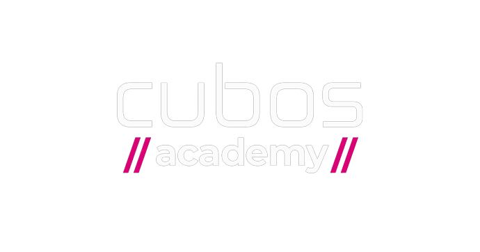
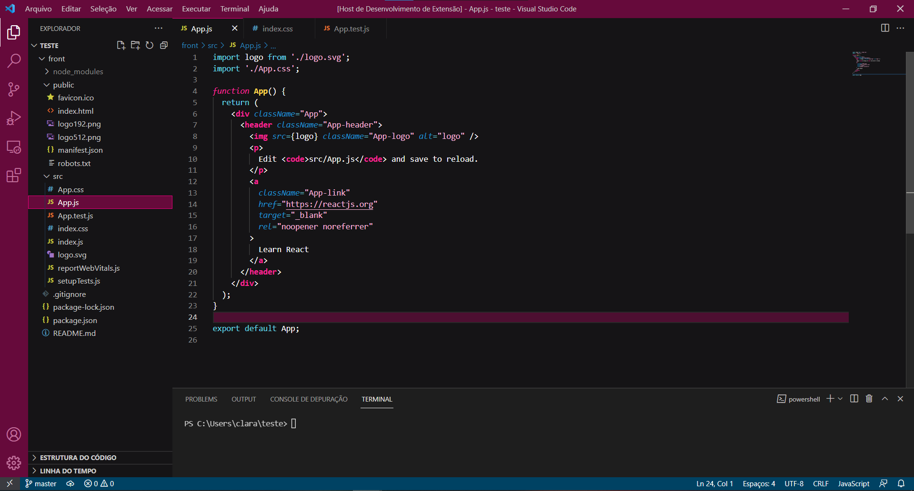

# Cubos Academy Theme

    

 

> Um tema escuro para [Visual Studio Code](http://code.visualstudio.com).

 
<!-- Preview in vscode.dev -->
 
<!-- marketplace version -->

<!-- downloads -->

 <!-- rating -->

  

## Ativar tema

Abrir atalho:

-  <a href="https://code.visualstudio.com/shortcuts/keyboard-shortcuts-linux.pdf">Linux</a> `Ctrl + Shift + P`
-  <a href="https://code.visualstudio.com/shortcuts/keyboard-shortcuts-macos.pdf">macOS</a> `⌘ + Shift + P`
-  <a href="https://code.visualstudio.com/shortcuts/keyboard-shortcuts-windows.pdf">Windows</a> `Ctrl + Shift + P`

Digite `tema`, escolha `Preferências: Tema de Cores` e selecione o tema Cubos Academy Theme na lista.
